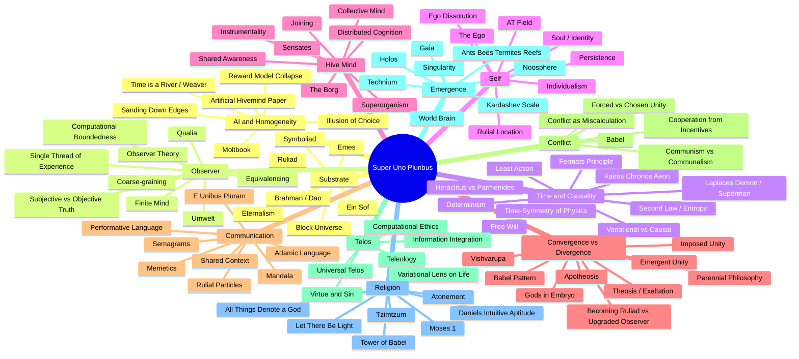
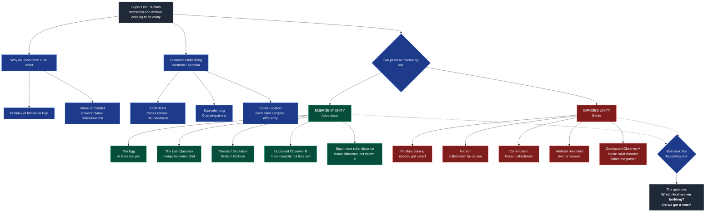

# Super Uno Pluribus — Mind Map

> "Over One, The Many." Three diagrams: the **concept clusters**, the **central tension** that organizes them, and the **sources** that feed each cluster. Companion glossary in [notes.md](notes.md).

---

## 1. Concept Clusters

The framework breaks into roughly twelve clusters. Each is a node in the larger argument; many concepts live on the boundary between two.

---

## 2. The Central Tension

The clusters all hang off one organizing dialectic: **two paths that look like "becoming one"** but are inverses of each other. This is the spine of the essay.

---

## 3. Sources → Concepts

Which works speak to which clusters. Use this when you need a citation for a given idea, or when you want to know which works are pulling double duty.

```mermaid
flowchart LR
    subgraph SF[Science Fiction]
        Pluribus
        LastQ[The Last Question]
        Answer
        Egg[The Egg]
        Arrival[Arrival / Stories of Your Life]
        Anthem
        Eva[Evangelion]
        Childhood[Childhood's End]
        Sense8
        Matrix[The Matrix]
        Heroes
        Chuck
        Hitchhiker
        Borg[Star Trek / Borg]
        Interstellar
        Prisoner[The Prisoner]
        ChildrenRuin[Children of Ruin]
        Thor
        RickMorty[Rick and Morty / Unity]
        EndersGame[Ender's Game]
        Novel2034[2034]
    end

    subgraph PH[Physics / Philosophy]
        ObserverTh[Observer Theory - Wolfram]
        RuliadEss[The Ruliad - Wolfram]
        Senchal[God Conjecture - Senchal]
        Symboliad
        Laplace[Laplace / Reichenbach]
        Bat[Nagel - What Is It Like to Be a Bat]
        Umwelt[Yong - An Immense World]
        Hawkins[Power vs Force - Hawkins]
        Matthews[Transparent Minds - Matthews]
        DFW[E Unibus Pluram - DFW]
        ArtHive[Artificial Hivemind paper]
    end

    subgraph REL[Religion / Theology]
        LDS[LDS - Gods in Embryo / Exaltation]
        Kabbalah[Ein Sof / Tzimtzum]
        Babel[Tower of Babel]
        Vish[Bhagavad Gita - Vishvarupa]
        Perennial[Perennial Philosophy]
        Adamic[Adamic Language]
        Moses1[Moses 1]
        Daniel[Daniel - Intuitive Aptitude]
    end

    subgraph TECH[Technology / Emergence]
        Kelly[Kevin Kelly - Technium / Holos]
        Teilhard[Teilhard - Noosphere]
        Lovelock[Lovelock - Gaia]
        Wells[HG Wells - World Brain]
        Kurzweil[Kurzweil - Singularity]
        Moltbook
    end

    subgraph C[Clusters]
        Substrate
        Observer
        Time[Time and Causality]
        Self
        Hive[Hive Mind]
        Converge[Convergence vs Divergence]
        Comm[Communication]
        Conflict
        Telos
        Emerge[Emergence]
        Religion
        AIHomog[AI Homogeneity]
    end

    Pluribus --> Hive
    Pluribus --> Converge
    Pluribus --> Self
    LastQ --> Converge
    LastQ --> Telos
    LastQ --> Time
    Answer --> Converge
    Egg --> Converge
    Egg --> Self
    Egg --> Religion
    Arrival --> Time
    Arrival --> Comm
    Arrival --> Telos
    Anthem --> Self
    Anthem --> Conflict
    Eva --> Self
    Eva --> Hive
    Childhood --> Converge
    Childhood --> Emerge
    Sense8 --> Hive
    Sense8 --> Comm
    Matrix --> Hive
    Heroes --> Observer
    Chuck --> Comm
    Hitchhiker --> Telos
    Borg --> Hive
    Interstellar --> Time
    Prisoner --> Self
    ChildrenRuin --> Hive
    Thor --> Observer
    RickMorty --> Hive
    EndersGame --> Conflict
    Novel2034 --> Conflict

    ObserverTh --> Observer
    ObserverTh --> Substrate
    RuliadEss --> Substrate
    RuliadEss --> Observer
    RuliadEss --> Converge
    Senchal --> Religion
    Senchal --> Telos
    Senchal --> Converge
    Senchal --> Substrate
    Symboliad --> Substrate
    Symboliad --> Comm
    Laplace --> Time
    Bat --> Observer
    Umwelt --> Observer
    Hawkins --> Observer
    Matthews --> Hive
    Matthews --> Comm
    DFW --> Comm
    DFW --> AIHomog
    ArtHive --> AIHomog
    ArtHive --> Comm

    LDS --> Religion
    LDS --> Converge
    Kabbalah --> Substrate
    Kabbalah --> Religion
    Babel --> Conflict
    Babel --> Converge
    Vish --> Religion
    Vish --> Substrate
    Perennial --> Religion
    Adamic --> Comm
    Moses1 --> Religion
    Daniel --> Observer

    Kelly --> Emerge
    Kelly --> Telos
    Teilhard --> Emerge
    Lovelock --> Emerge
    Wells --> Emerge
    Kurzweil --> Emerge
    Kurzweil --> Self
    Moltbook --> AIHomog
    Moltbook --> Conflict

    classDef cluster fill:#1e3a8a,color:#fff,stroke:#3b82f6,stroke-width:2px
    class Substrate,Observer,Time,Self,Hive,Converge,Comm,Conflict,Telos,Emerge,Religion,AIHomog cluster
```

---

## How to use these diagrams

- **Cluster diagram** is the home view — twelve themes, each a candidate section in the essay.
- **Tension diagram** is the spine — when in doubt about whether something belongs in the essay, ask: does it sharpen the "two paths" question?
- **Sources diagram** is the citation map — when you're writing a paragraph about, say, the Observer cluster, this tells you which works to draw from.
- **Glossary**: see [notes.md](notes.md) for definitions, quotes, and notes per concept.
